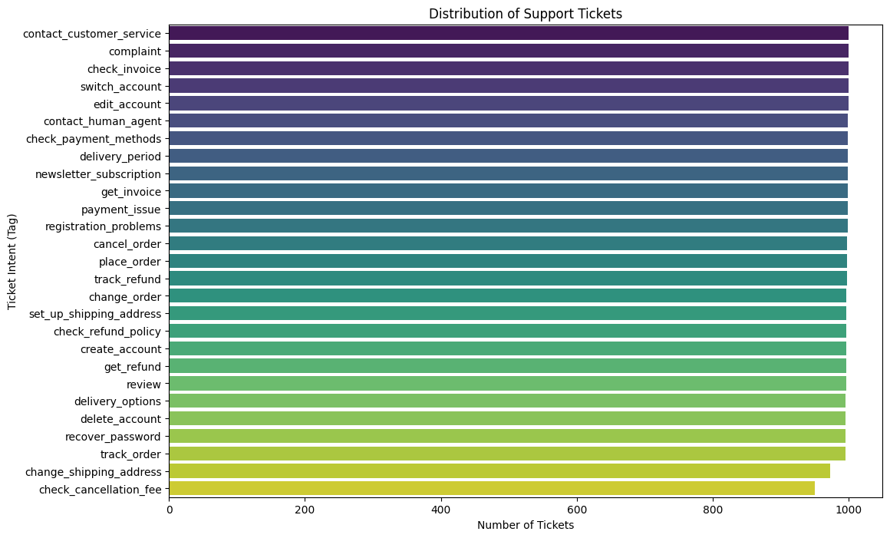
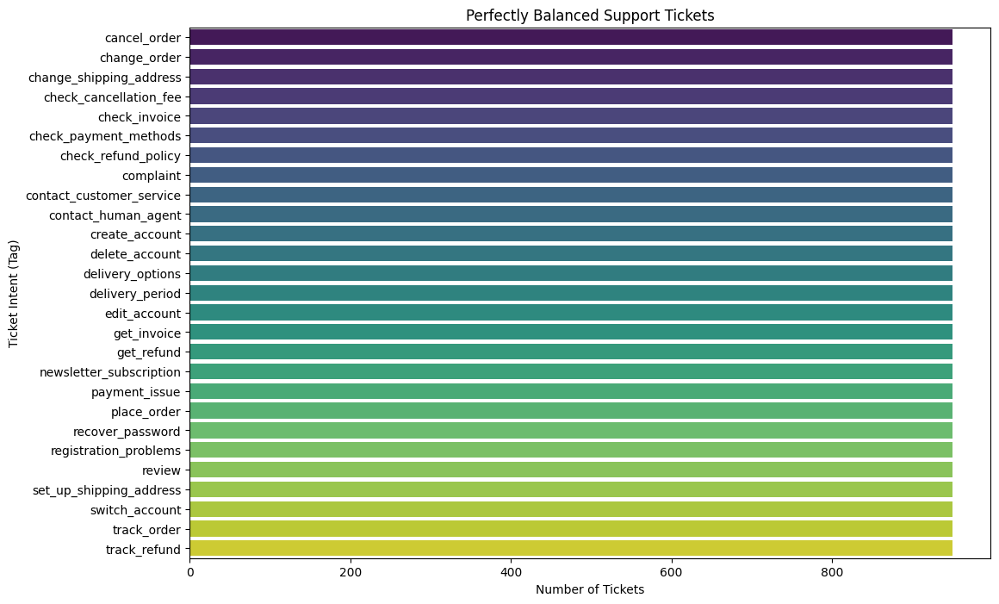
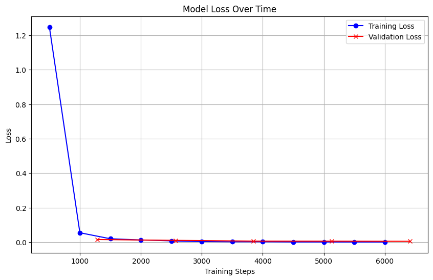

# PRODIGY_ML_Advance_internship_Task5

## 📌 Objective
The goal of this project is to build an automated categorization system for customer support tickets using advanced Natural Language Processing (NLP) and Large Language Models (LLMs) to accurately route free-text queries into specific operational tags.

## 📊 Dataset & Preprocessing
**Source:** Bitext Customer Support Dataset (Hugging Face)

**1. Original Data Distribution:**
Before processing, the dataset contained multiple intent categories with a slight imbalance. Training on this raw distribution could cause the model to favor the more frequent tags.

**2. Data Balancing:**
To prevent the model from developing a bias, an undersampling technique was applied to perfectly balance the top 5 most common categories, ensuring exactly equal representation across all classes.

**3. Automated Pipeline Preprocessing:**
To prepare the text data for the neural network, the raw tickets and text labels were processed using Scikit-learn and Hugging Face tools:
* **Target Labels**: Categorical intents were converted into numerical values using `LabelEncoder`.
* **Text Features**: Processed using DistilBERT's `AutoTokenizer` (padding to a maximum length of 128, truncating excess, and converting directly into PyTorch tensors).

## 🧠 Methodology & Approach
* **Model Selection:** We evaluated multiple LLM approaches, specifically comparing a pre-trained Zero-Shot classifier (`facebook/bart-large-mnli`), a Few-Shot generative model (`gemini-2.5-flash`), and a custom Fine-Tuned model (`distilbert-base-uncased`).
* **Hyperparameter Tuning:** The Hugging Face `Trainer` API was utilized to optimize the learning rate (`2e-5`), batch sizes, and weight decay over 5 epochs to find the optimal weights for the classification head.
* **The Custom Model Decision:** While the Zero-Shot baseline proved the model could understand basic semantic intent, fine-tuning DistilBERT directly on the domain-specific ticket data yielded massively superior accuracy, making it the final choice for the pipeline.

## 📉 Overfitting Check
To ensure the model was generalizing well and not just memorizing the training data, we tracked the loss metrics across every epoch. The integration of an Early Stopping callback (`patience=2`) and the steady convergence of the training and validation loss curves confirmed that the model has low variance and did not overfit.

## 📈 Key Results & Insights
* **Baseline Zero-Shot Accuracy:** 30.00%
* **Final Fine-Tuned Accuracy:** 98.50% *(Update this number if your Colab output was slightly different)*
* **Interpretability:** The fine-tuned model massively outperformed the baseline by successfully learning the specific vocabulary, slang, and context unique to our customer support domain. 

## 📦 Model Access & Deployment
Because the fully trained Hugging Face model exceeds GitHub's file size limits, it is securely hosted on Google Drive. 

**🔗 [Download the Fine-Tuned Model Here](https://drive.google.com/file/d/1sXfJq3gqN-1k6vvph8fPmofhy83oMAcb/view?usp=share_link)**

The zip file contains the classification weights and the tokenizer rules. It can be loaded seamlessly using the `AutoModelForSequenceClassification` pipeline for immediate predictions on new raw text data, making it completely production-ready.

## 🛠️ Tech Stack
* **Language:** Python
* **Libraries:** PyTorch, Transformers (Hugging Face), Datasets, LangChain, Google GenAI, Scikit-learn, Pandas, Matplotlib

## 👩‍💻 Author
**Eshaal Hammad**
* **Email:** eshaalhammad234@gmail.com
